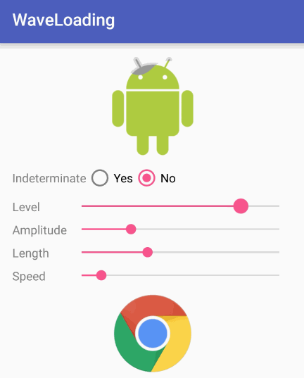

#WaveLoading Xamarin Binding

This library provides a *wave loading* animation as a **Drawable**.



## How to use

Add Reference to the project and include the namespace
```
using Com.Race604.Drawable.Wave;
```

Use in your project with only one line:

```
Drawable mWaveDrawable = new WaveDrawable(otherDrawable);

// Use as common drawable
imageView.SetImageDrawable(mWaveDrawable);
```

Original Java Project
https://github.com/race604/WaveLoading


## License
MIT
